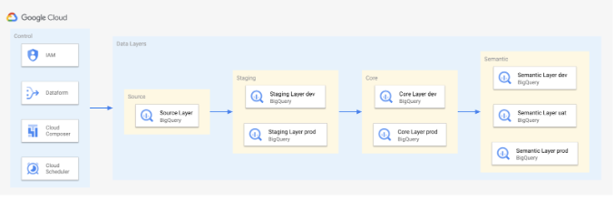

# Readme

Hello and welcome to Cloud BI Fabric

## Description and Goals

Cloud BI Fabric is the architectural building block to help build a semantic layer on Google Cloud to be used for your business intelligence needs.

This repository provides a boilerplate code asset that enables users to deploy a semantic layer following best practices by Google Cloud. It sets up the required project and DWH requirements. Dataform as the ETL tool is instantiated and an existing repository can be attached; IAM, composer (TBD) and scheduler(TBD) is also included. Ease of use is ensured by allowing the user to use a YAML file to configure the semantic layer. The repository is ideally being used with the accompanying TDD.

The following diagram is a high-level reference of the resources created and managed here:


## Requirements

For this building block to work, the following things are required:

- access to Google Cloud and permissions to create additional resources
- Terraform => 1.6.5 installed

## How to use

Before we can deploy, we need to set up the configuration; we use a `config.yaml` file that contains the following information:

```
general_settings:
  control_billing_account: *the billing account for the control project*
  control_parent_folder: *the folder for the control project*
  layers_billing_account: *the billing account for the layers projects*
  layers_parent_folder: *the folder for the layer projects*
  organization-domain: *your organizations domain*
  project-prefix: *prefixes for the project_ids*
control:
  project_id: *the control projects id*
  location: *the control projects location*
  pipeline_sa: *the SA name that will be used to execute the ETL pipeline*
dataform:
  dataform_secret_name: *the dataform secrets name (will hold the github token required to connect with 3P repositories)*
  dataform_repository_name: *the dataform repositories name*
  dataform_remote_repository_url: *the dataform repository url*
  dataform_remote_repository_token: *the generated token (e.g. Github)*
iam:
  data_engineers: *IAM group for data engineers*
  data_analysts: *IAM group for data analysts*
  data_consumers: *IAM group for data consumers*
layers: (here, we define the layers, their names and environments)
  - name: source
    location: europe-west3
    envs: *comment out/remove environments not required*
    - dev
    - uat
    - prod
  - name: staging
    location: europe-west3
    envs:
    - dev
    - prod
  - name: core
    location: europe-west3
    envs:
    - dev
    - prod
  - name: semantic
    location: europe-west3
    envs:
    - dev
    - uat
    - prod
```

Afters thats done, jump into the terminal

`terraform init` to install all modules
`terraform plan` to make sure it all works to plan
`terraform apply` to create the required resources

## TODO

- [ ] Detailed Readme
- [ ] Add Composer Env
- [ ] Add Scheduler
- [ ] Create example use case
