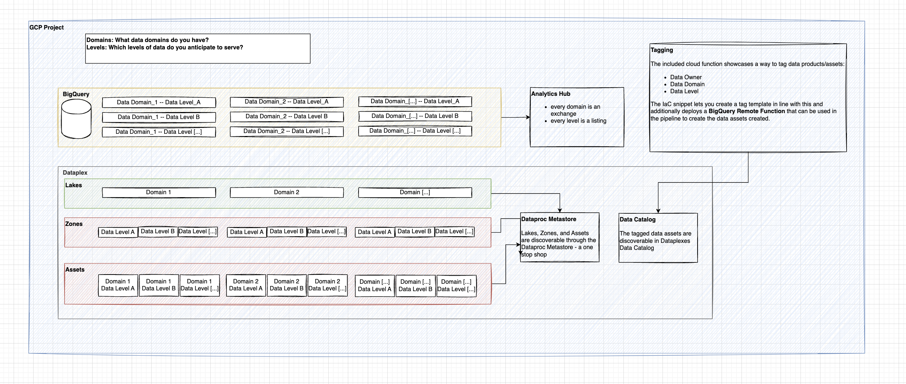

# Readme

Hello and welcome to Cloud BI Fabric

## Description and Goals

Cloud BI Fabric helps to set up and deploy a structured cloud data platform that serves the need to implement Business Intelligence on top of it.

This project/repository provides a boilerplate code asset that enables users to deploy a minimal cloud data platform that is ready to be consumed by business intelligence tools and already included in other areas of the cloud platform: data governance, data catalog, etc.
The goal is, to help users jump the first hurdle of setting something seemingly complicated up, see how it works and then enhance the given solution according to their needs.
If wanted, this also comes with a example dataform repository built on top of the `thelook_ecommerce` dataset.

## Requirements

For this asset to work, the following things are required:

- a Google Cloud Project with billing activated
- a Google Cloud Bucket used to store the Terraform state file (will be created)
- a service account that is used to run terraform and can be impersonated by the account used (will be created)
- the right APIs activated

## How to use

Before we start, we need to set a few env variables in the terminal(do not c&p the dollar sign):

```
$ export PROJECT_ID=<Your GCP Project>
$ export ACCOUNT=<Your Account, email format>
$ export TERRAFORM_SA=<The name of the service account to be used for Terraform. This will be the input for the script down below, so it needs to be set. Only the name required of the service account, not the full adress (you will hit a 30 character limit)>
$ export REGION=<Your region>
$ export TF_BUCKET=$PROJECT_ID-terraform
```

Next up, authenticate into Gcloud (please note, both these require confirmation in a browser window):

```
gcloud auth login --project $PROJECT_ID
gcloud auth application-default login --project $PROJECT_ID
```

You can confirm that it has worked by checking `gcloud config list` and making sure that the information matches whats expected.

After that, we need to activate the required APIs, create the terraform account that is going to be used to run terraform, and the GCS bucket to store the state file.

```
$ bash ./getting_started/enable_required_apis.sh
$ bash ./getting_started/create_terraform_service_account.sh
$ bash ./getting_started/create_terraform_state_bucket.sh
```

Finally, we need to create a \*.tfvars to let terraform know what to deploy. Being in the main folder of the repo, just type `touch terraform.tfvars` (or any other name you prefer)!

```
project_id                        = <Your Project ID
data_levels                       = <Your desired data levels, e.g. ["source", "intermediate", "output"]>
data_domains                      = <Your desired domains of data, e.g. ["orders", "web"]>
dataform_repository_name          = <Your dataform repository name>
dataform_remote_repository_url    = <Link to Dataform Repository> If you want to try out the demo, clone this repository: "https://github.com/marcjwo/thelook_dataform"
dataform_remote_repository_token  = <Your Github access token to be used by dataform. Follow instructions here:(https://cloud.google.com/dataform/docs/connect-repository)>
dataform_secret_name              = <Secret where the token is stored>
dataform_remote_repository_branch = <Branch name, typically main>
region                            = <Your cloud region>
terraform_sa                      = <The service account that is used for terraform (and was created in the previous step) - only the prefix before the '@' required here>

# Below, the variable to create tag_templates - these follow a specific format, an example is below. This example can be used and is in line with the tagging function thats being deployed with the platform.

tag_templates = [{
  id           = "tag_template1"
  display_name = "tag_template1"
  force_delete = true
  fields = [{
    order       = 1
    id          = "data_owner"
    type        = "STRING"
    is_required = true
    }, {
    id           = "data_level"
    display_name = "Data Level"
    order        = 3
    type         = "ENUM"
    values = [
      "source",
      "intermediate",
      "output"
    ]
    is_required = true
    },
    {
      order       = 2
      id          = "data_domain"
      type        = "STRING"
      is_required = true
    }
  ]
}]
```

_Important note:_ The tag template here goes 🤝 hand in hand with the cloud function thats being deployed and can be found under `./functions/tagging`.

Finally, we can start the deploying:

```
$ terraform init -backend-config="bucket=${TF_BUCKET}"
$ terraform plan
$ terraform apply -var-file=<yourvarfile.tfvars> (This arg can be avoided by calling the file terraform.tfvars)
```

You will have to approve the changes once terraform is applied, and after doing so, it will take a few minutes to deploy everything.

## Whats being deployed?

- a GCS data bucket to be used to ingest data into (Details on that further down below)
- a GCS resource bucket. This is being used to store the cloud function thats being deployed.
- a ready to be used BI service account with the right permissions to use BQ (permissions are set on project level, not on dataset level. If this matures, this needs to be adjusted accordingly.)
- a number of BQ datasets: the anticipation here is that the user will want to store data in distinct datasets based on data level (source, intermediate,output) and data domain (marketing, sales, etc). If this matures, the anticipation is that different data domains will end up in separate projects
  - for every data domain, an analytics hub exchange is created, adding the datasets as listings to it
  - for every data domain, a dataplex lake is created, adding the datasets as zones and assets to it
  - **To be done:** to create a one stop shop for end users to go through the Dataplex landscape, it seems possible to deploy a [Dataproc Metastore](https://cloud.google.com/dataproc-metastore/)
- a dataform instance with a 3rd party Git Repository attached to it.
  - this includes a Google Secret to store the Github token
- Data catalog and a tag template. The tag template has three tags: data owner, data domain, and data level. This allows for searching in the data catalog accordingly
- a Cloud Function for tagging tables
  - this is built to correspond with the above mentioned tag template and is being deployed as a Big Query remote function; this way it can be used in dataform to tag tables accordingly when being modeled - a post_processing step can be applied in dataform and is showcased in the sample repository

## How does this work?

**This is assuming you want to try this asset using the demo prepared: **Before we can start exploring, there is one additional step to be done. There is a `bigquery_exrtact.sql` file in the `getting_started` subfolder. Replace the `{name_of_the_data_bucket}` part with the name of the deployed data bucket (should be "YOUR_PROJECT_ID-data_bucket"Copy the content and execute in the BQ workbench - this extracts the BigQuery tables of the `thelook ecomm` dataset into GCS. The reason for this is: the dataset resides in the US region and as the the author of this asset resides in EMEA, the data need to get out first. You can obviously forgo this step if in the US, but this also creates a nice way of showcasing on how to work with data being ingested into GCP not directly into BQ.

Once this is done, we can navigate to Dataform first. If you have attached the dataform repository to the cloned version of the demo repository, you will have to create a workspace to work in, and after initializing you end up in the dataform interface.

The TL;DR for Dataform:

- the `dataform.json` file contains project specific information and variables. This needs to be adjusted [accordingly](https://cloud.google.com/dataform/docs/configure-dataform). Make sure that the gcs_data_bucket is in line with where the tables were exported to previously, and that `defaultDatabase` matches your configuration.
- the `includes/` subfolder can be used to define Javascript includes to be used throughout the project. Useful for additional variables (tag values e.g.) or documentation (think column descriptions, etc)
- the `definitions` subfolder is where the sql statements happen. Its divided into three subfolders `1_sources`, `2_intermediate`, and `3_ouput`. The names should be self explanatory. In sources we define the source tables, in our case operations that read from the GCS dump. Intermediate is used for transformations, steps required in between. In output, we put whats being consumed essentially by the BI tool (or e.g. data scientists via Notebooks etc).
  - the output folders contain multiple outputs: a/ the outputs that resemble the known structure of `thelook` and how its been typically consumed by Looker --> separate tables that are modelled in Looker, b/ flat tables, that do the transformation in BQ and provide one large table to be consumed (this can be further adjusted with nested fields etc) and that also have a post_operation used to tag the tables for data catalog.

**WORK IN PROGRESS**

The corresponding Looker repository to showcase the different version can be found here: https://github.com/marcjwo/thelook_dataform_looker

Use this as a remote repository, override the constants as required, and fire away. 🔥

For demonstrating purposes, see schema below.

- Define data domains to separate data products by domain
  - Every data domain gets a separate data lake
  - Enables finer permission setting
- Define data levels to define layers of data
  - This simplifies the identification of the state of data
  - Every layer equals one zone


